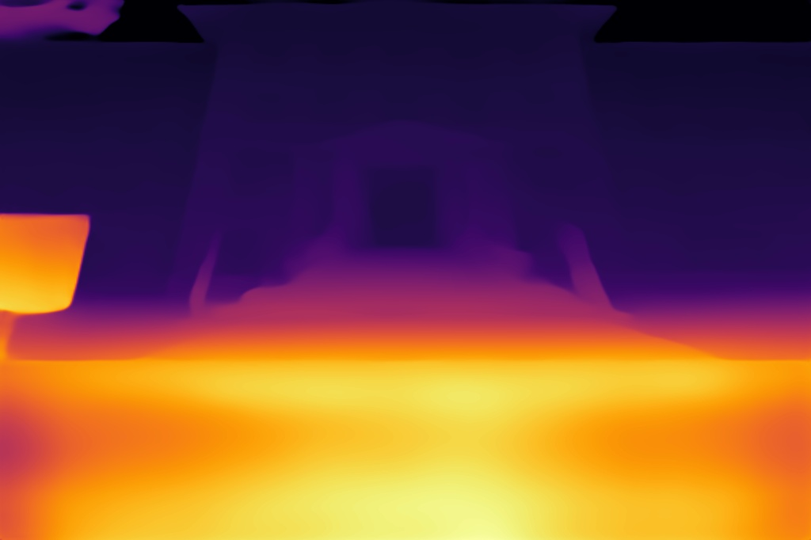

# Depth Anything MNN


## python 
Run:
```bash
cd mnn_python
python dam.py
```

## cpp
Prapare libMNN/libMNN_Express/libMNNOpenCV file as in CMakeList.txt, make:

```bash
cd mnn_cpp
mkdir build; cd build
cmake ..
make
```
Run:
```bash
./dam ../../dam.mnn ../../image.jpg
```

## result




## reference
https://github.com/alibaba/MNN 

https://github.com/fabio-sim/Depth-Anything-ONNX 

https://github.com/LiheYoung/Depth-Anything 

